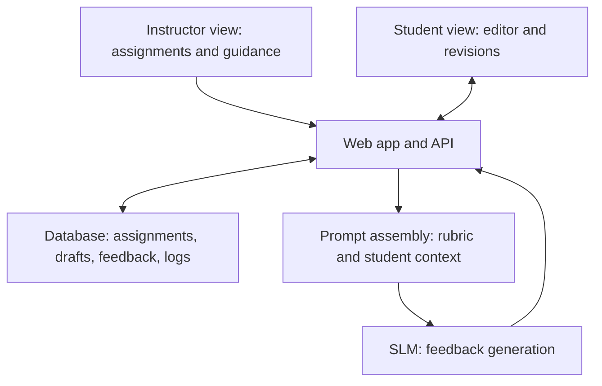

# Adaptive System for Teaching Writing to CS Students

A McMaster University SE/CS capstone project exploring how an adaptive writing tutor can help computer science students develop technical writing skills while completing instructor-assigned work.

> **Status:** Early planning. This README describes the project brief, a proposed first prototype, and open decisions. The architecture, datasets, model, and evaluation protocol are not final.

**Supervisor:** Angela Zavaleta Bernuy  
**Team:** Tom Wu, Yuexi Sun, Qinquan Wang, Yitian Kong, Wenhan Dong, Yan Bao, Mike Wang  
**Working notes:** [Project Google Doc](https://docs.google.com/document/d/1K5lFrNLaMaNFKR39uyPfvbRyfVf2wtXWX1RTmIkS7WU/edit?usp=sharing)

## Why this project?

Technical writing helps CS students explain their work, yet students may increasingly rely on AI to produce text without practicing the underlying skill. Our goal is to build a tutor that supports the writing process through actionable, personalized guidance. The system should account for instructor instructions and a student's writing ability, interests, and recurring challenges.

The capstone brief calls for three connected components:

1. **Instructor and student views:** Instructors provide assignments and customization; students work through writing tasks iteratively.
2. **Small language model (SLM):** A model that supports co-writing and gives personalized feedback, with fine-tuning as part of the capstone scope.
3. **Backend and research logs:** Store instructor input, assemble guidance and model context, deliver feedback, and collect interaction data for analysis.

## Proposed first prototype

- An instructor creates an assignment and supplies guidance, a feedback rubric, and optional information about a student's interests or writing challenges.
- A student writes a draft in a simple web editor and requests feedback.
- The backend combines the draft, assignment, rubric, instructor guidance, and appropriate student context into a prompt for an SLM.
- The student sees specific suggestions and revises the draft. The system records feedback and revisions for evaluation, subject to the project's data and consent requirements.

The first prototype can use **feedback on request or after draft submission**. Whether to add real-time assistance is an open design question. The tutor should help students improve their own writing; the precise level of co-writing support needs agreement with the supervisor.

## Proposed system architecture

**Candidate stack:** Next.js/React for the web app and API; MongoDB for application data; a Hugging Face SLM for inference and possible fine-tuning; Weights & Biases for experiment tracking and model evaluation. These are options, not finalized dependencies. The database would hold application state; W&B would track experiments rather than serve as the student-facing application database.

## Model and dataset plan

| Stage | Question to answer | Required data or output |
| --- | --- | --- |
| Pretrained baseline | Can an available SLM give useful feedback on CS writing? | Representative drafts, assignments, and a small human-reviewed evaluation set |
| Prompt and rubric baseline | Does supplying instructor guidance, examples, and a consistent rubric improve feedback? | Rubric, example prompts, and the same held-out evaluation set |
| Supervised fine-tuning | Does training on instructor-quality feedback improve the baseline enough to justify its cost? | Permitted draft–feedback examples, train/validation/test split, and documented annotations |
| Adaptive feedback strategy (exploratory) | Would choosing among feedback strategies improve learning or engagement? | Defined strategies, measurable outcomes, sufficient interaction data, and an evaluation plan |

Prompting changes the **model input**; supervised fine-tuning changes **model weights**. A multi-armed bandit, if used, would choose among strategies based on measured rewards. It is not the same as fine-tuning the SLM or necessarily using reinforcement learning to update its weights. We should establish a baseline and a reliable feedback rubric before attempting adaptive strategy selection.

### Dataset requirements to investigate

- **Task fit:** Writing samples should resemble the CS assignments and technical explanations we intend to support.
- **Permission and provenance:** Check licensing, consent, access conditions, and whether student work can be used for training and logging.
- **Feedback quality:** Prefer examples with clear, actionable instructor feedback tied to a rubric; raw essays alone are insufficient for supervised feedback training.
- **Evaluation:** Keep held-out examples separate from training data. Evaluate usefulness, correctness, specificity, tone, rubric alignment, and whether feedback helps students revise.
- **Data minimization:** Decide what student text and interaction events are necessary for the agreed research questions before storing them.

Candidate starting points for dataset investigation include [CoAuthor](https://coauthor.stanford.edu/), [Kaggle](https://www.kaggle.com/search), and the [College Writing Dataset listing](https://tools-competition.org/winner/college-writing-dataset/#). None has been selected or approved for this project.

## Questions for the Wednesday meeting

1. **Writing task:** Which CS writing genres and assignment types should the first prototype cover? What counts as useful feedback versus excessive co-writing?
2. **Feedback timing:** Should students request feedback on a draft, receive it after submission, or receive suggestions while typing?
3. **Rubric:** What dimensions should instructors and students see? Who will judge the quality of generated feedback, and with what examples?
4. **Training data:** Is an authorized collection of student drafts and instructor feedback available? If not, whom can we ask, and what approval or dataset request is needed?
5. **SLM and compute:** What model size, hosting environment, training hardware, budget, and response time are realistic?
6. **Fine-tuning:** What evidence would justify moving from a prompt baseline to supervised fine-tuning? How many trustworthy labeled examples could we obtain?
7. **Adaptation:** Does the project require a bandit-based strategy selector? If so, what are its selectable strategies, reward signal, and evaluator, and how will we avoid using a model's own score as the only success measure?
8. **Research logs:** Which research questions should logs answer? Are quantitative measures, qualitative analysis, or both expected? What are the consent and retention requirements?

## Initial milestones

1. Agree on a narrow writing task, rubric, feedback timing, and evaluation criteria.
2. Find an authorized dataset or establish a process for creating and labeling a small representative set.
3. Build a minimal instructor-to-student writing flow and evaluate a pretrained SLM baseline.
4. Compare rubric-guided prompting against that baseline using human-reviewed examples.
5. Fine-tune and assess an SLM if the data supports it; investigate adaptive strategy selection if the baseline and study design make it useful.

## Background reading

These are starting points supplied for the project, not evidence that a particular implementation has been selected.

- [Intelligent Tutoring Systems for Literacy: Existing Technologies and Continuing Challenges](https://eric.ed.gov/?id=ED577131) — writing-focused tutoring systems.
- [Multi-Armed Bandits for Intelligent Tutoring Systems](https://doi.org/10.48550/arXiv.1310.3174) — adaptive teaching strategy selection.
- [Adaptive Training Environment without Prior Knowledge](https://doi.org/10.1145/2930238.2930256) — feedback selection as a bandit problem.
- [Integrating Small Language Models with Retrieval-Augmented Generation in Computing Education](https://doi.org/10.1145/3641554.3701844) — SLMs in computing education.
- [Can Small Language Models With Retrieval-Augmented Generation Replace Large Language Models When Learning Computer Science?](https://doi.org/10.1145/3649217.3653554) — SLMs in a CS learning setting.
- [Hugging Face model hub](https://huggingface.co/models) and [documentation](https://huggingface.co/docs) — model and tooling exploration.

More papers, dataset leads, and discussion notes are collected in the [working document](https://docs.google.com/document/d/1K5lFrNLaMaNFKR39uyPfvbRyfVf2wtXWX1RTmIkS7WU/edit?usp=sharing).
